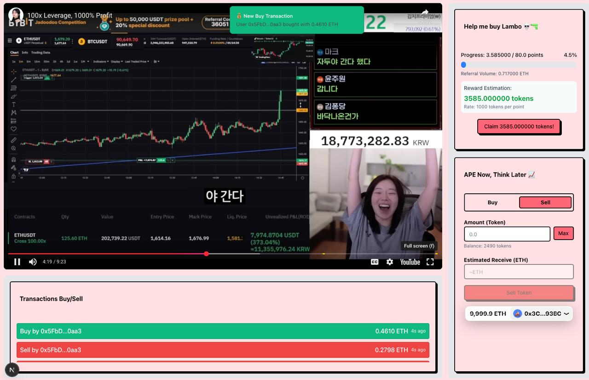

# StreamFund (No Partner Integration)



Is a streaming meta narrative for everyone. Inspired by the idea of creating a platform where everyone can participate and make the hype of specific event or token. Let's everyone do the marketing for you.

## Introduction

StreamFund is a custom hooks in Uniswap V4 that allows token creators to set up bounty rewards for making a hype around their tokens. Think of it as a troops of marketing agents who are incentivized to promote the token in exchange for rewards. Anyone can join the hype army and earn rewards by participating in promotional activities with streaming.

## Demo

Watch the StreamFund demo video to see how it works:

[](https://www.loom.com/share/df92893804fc4c1f86335aae77fbf92e?sid=c83f2210-bb91-4232-85e8-319f937a9f36)

## Features

- Configurable reward rates per 1 ETH volume traded
- Measure trading volume of referred users
- Using the same token for rewards ties to specific ERC6909 ID
- Shareable streaming links in any social media platform

## Installation

### Prerequisites

- [Foundry](https://book.getfoundry.sh/getting-started/installation)
- [Git](https://git-scm.com/)
- [Node.js](https://nodejs.org/en/download/)
- [pnpm](https://pnpm.io/)
- [Make](https://www.gnu.org/software/make/)

### Setup Instructions

1. **Clone the repository**

   ```bash
   https://github.com/wildanzrrr/uhi-hooks-contract
   cd uhi-hooks-contract
   ```

2. **Install dependencies**

   ```bash
   # Install Foundry dependencies
   forge install
   ```

3. **Copy the example configuration file**

   ```bash
   cp .env.example .env
   cp frontend/.env.example frontend/.env
   ```

4. **Install Node.js dependencies**

   ```bash
   pnpm install
   ```

5. **Install frontend dependencies**

   ```bash
   cd frontend
   pnpm install
   ```

6. **Run local anvil node**

   ```bash
   anvil
   ```

7. **Run local deployment script**

   In another terminal, run:

   ```bash
   make deployAll
   ```

8. **Run the frontend application**

   In another terminal, run:

   ```bash
   cd frontend
   pnpm dev
   ```

   Then open your browser and navigate to `http://localhost:3000`.

9. **Simulate trading volume**

   In another terminal, run:

   ```bash
   pnpm simulate-trades
   ```

## Usage

### Development Commands

#### Overview

```bash
# Using Makefile
make <command>

make help  # List all available commands
make deployCore # Deploy Uniswap V4 Core contracts
make generateSalt # Generate Hook Salt
make deploySF # Deploy StreamFund contract
make deployAll # Deploy all contracts in sequence (Core, Salt, StreamFund)
make test # Run all tests
make testCoverageReport # Generate HTML coverage report
```

#### Code Formatting

```bash
forge fmt
```

## Project Structure

```
uhi-hooks-contract/
├── Makefile
├── package.json
├── README.md
├── frontend/                     # Next.js frontend application
│   ├── components/
│   └── ...
├── lib/                          # External libraries (installed via Foundry)
│   ├── forge-std/
│   └── ...
├── script/                       # Deployment and utility scripts
│   ├── DeployCore.s.sol
│   ├── ...
├── src/                          # Smart contract source code
│   └── StreamFund.sol
└── test/                         # Test files
    └── StreamFund.t.sol


```

## Development Tools

- **VS Code**: Recommended IDE with Solidity extensions
- **Foundry**: Smart contract development framework
- **Next.js**: React framework for the frontend application

## License

MIT License - see the [LICENSE](LICENSE) file for details.
